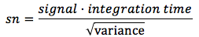
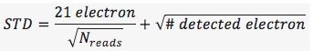

This DRP assumes that targets are nodded along the slit with integration times as described on the instrument web page. The integration times described were selected such that the shot-noise in the region between night sky lines is over 5x larger than the read noise of a 16-fowler sample. For MOSFIRE, we define this as background limited.

Despite MOSFIRE’s (unprescedented) f/2.0 camera, the desired integration time for background-limited operation is longer than the time for the atmosphere to vary by several percent. As a result, a further background subtraction step is required to remove the residual features. The step is performed by a function called background_subtract_helper() and follows the notation and procedure outlined in Kasen (2003; PASP 115). For most users, you’ll want to use the standard Driver file and not worry about the details. 

In the Driver.py file you want to uncomment the following:

    Background.handle_background(obsfiles, 'lambda_solution_wave_stack_J_m130114_0443-0445.fits', maskname, band, waveops)

The lambda_solution_wave_stack file needs to be updated in your driver file. If reducing Kband, be sure to use the merged wave_stack solution. It is one of the outputs from the last wavelength step (see section 8).

In this step:

* Apply the flat field corrections 
* A position files are combined (Offset_*.txt)
* B postion files are combined (Offset_-*.txt)
* Subtract A-B
* Correct for small differences in the background sky emission

## Output Files

The background subtraction step produces the following files. As usual elements in [brackets] are replaced with the value for that mask.

| Filename                         | Content (units)                                                             |
|----------------------------------|-----------------------------------------------------------------------------|
| `eps_Offset_[###].txt.fits` | Average signal in the ### stack ()            |
| `var_Offset_[###].txt.fits` | Total variance in each pixel of above file () |
| `itimes_Offset_[###].txt.fits` | Total exposure time in each pixel of above files () |
| `sub_[maskname] _[bandname]_[plan].fits` | Difference (but non background subtracted) file () |
| `bsub_[maskname]_{ bandname]_[plan].fits` | Background subtracted signal () |
| `bmod_[maskname]_{ bandname]_[plan].fits` | Background model signal () |
| `var_[maskname]_{ bandname]_[plan].fits` | Total variance |
| `itime_[maskname]_{ bandname]_[plan].fits` | Average integration time |

There is redundant information in the above set of files. For instance:

    sub_Mask_K_A-B.fits = eps_Offset_1.5.txt.fits – eps_Offset_-1.5.txt.fits
    var_Mask_K_A-B.fits = var_Offset_1.5.txt.fits + var_Offset_1.5.txt.fits
    itime_Mask_K_A-B.fits = mean(itime_Offset_1.5.txt.fits, itime_Offset_1.5.t.xt.fits)

If you want to drill further into how these are constructed, examine the Background.py imcombine and handle_background functions.

Recitified outputs are also computed as tabulated in the table below.

| Filename                         | Content (units)                                                             |
|----------------------------------|-----------------------------------------------------------------------------|
| `[maskname]_rectified_[bandname]_[plan].fits` | Signal () |
| `[maskname]_rectified_itime_[bandname]_[plan].fits` | Integration time  |
| `[maskname]_rectified_var_[bandname]_[plan].fits` | Variance  |
| `[maskname]_rectified_sn_[bandname]_[plan].fits` | Signal to noise () |

Note that signal to noise is computed as follows:

yes, we violate the first normal form for convenience. Also note that the STD is computed assuming the detector has a read noise of Detector.RN (documented in the MOSFIRE Pre Ship Review as 21 electron) per fowler sample. Thus, the final STD is

assuming the gain in Detector.gain. Note that there is no shot noise from dark current, which was measured to be negligible at pre-ship review.

An example of what the output looks like is here:

Image showing the itime, bsub, and rectified wavelength images. The green crosses are marking the location of the same pixel in each image.

